# 《Learning to Summarize from Human Feedback》论文总结

## 论文信息

- **标题**：Learning to Summarize from Human Feedback
- **作者**：Nisan Stiennon、Long Ouyang、Jeff Wu、Daniel M. Ziegler、Ryan Lowe、Chelsea Voss、Alec Radford、Dario Amodei、Paul Christiano
- **机构**：OpenAI
- **会议**：NeurIPS 2020
- **版本**：arXiv:2009.01325v3（2022-02-15）
- **原文**：[2009.01325v3.pdf](./2009.01325v3.pdf)

> **一句话总结**：相比模仿人工参考摘要，直接从人类偏好中学习奖励模型，再使用 PPO 优化语言模型，可以明显提高人类感知的摘要质量；但奖励模型只是人类偏好的近似，过度优化会引发奖励欺骗并使真实质量下降。

## 1. 研究背景与问题

传统摘要模型通常通过监督学习最大化人工参考摘要的生成概率，并使用 ROUGE 等自动指标评价质量。然而，这些目标都只是“好摘要”的代理：

- 最大似然目标不会区分事实错误与措辞差异的重要程度；
- 训练数据中的人工摘要本身可能不完整或质量较低；
- ROUGE 主要衡量词语重合，与人类对准确性、覆盖度和连贯性的判断并不完全一致；
- 模型在生成阶段会遇到训练分布以外的文本，导致质量下降。

论文因此研究：**能否直接根据人类的成对偏好，训练出更符合人类判断的摘要模型？**

## 2. 核心方法：SFT → RM → PPO

论文采用了一套后来成为经典范式的 RLHF 流程。

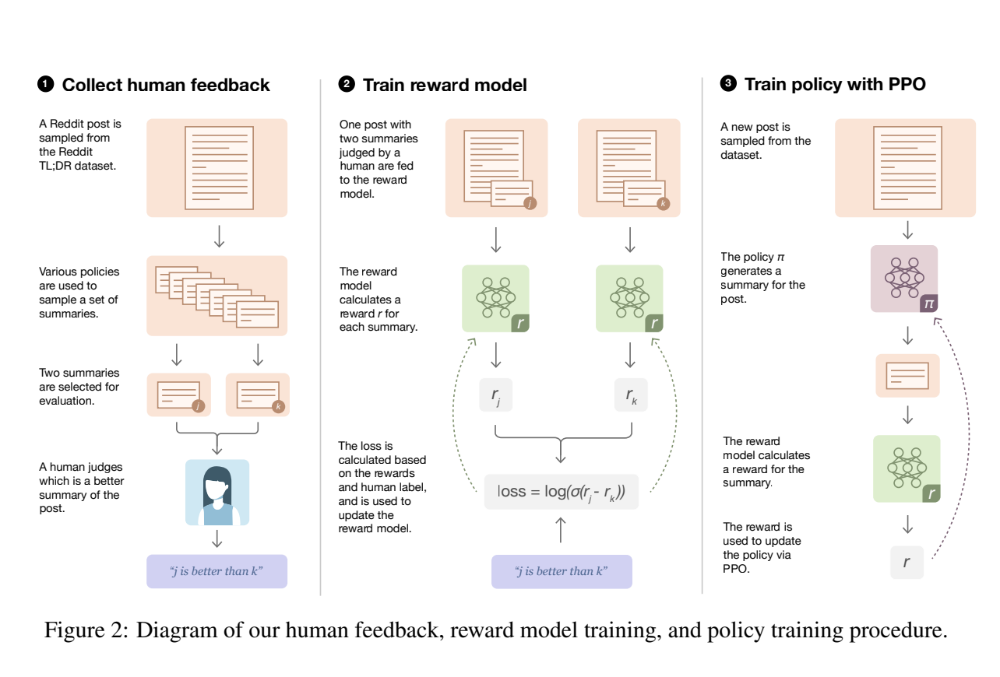

### 2.1 监督微调（SFT）

作者先在过滤后的 Reddit TL;DR 数据集上进行监督微调。该数据集最终包含 **123,169 篇帖子**，人工参考摘要被限制在 **24–48 个 token**。

监督模型有四个作用：

1. 作为普通监督学习基线；
2. 为人类比较任务生成候选摘要；
3. 初始化 PPO 策略；
4. 初始化奖励模型。

### 2.2 收集人类偏好

对于同一篇帖子，系统展示两个候选摘要，让标注员选择较好的一个。作者最终公开了 **64,832 组摘要比较数据**。

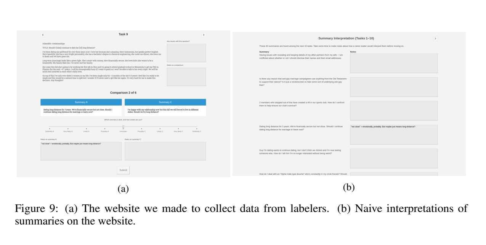

为控制标注质量，作者对标注员进行了培训、持续反馈和一致性监测：

- 标注员与研究人员的一致率约为 **77% ± 2%**；
- 研究人员彼此之间的一致率约为 **73% ± 4%**。

### 2.3 训练奖励模型（RM）

奖励模型输入原文 $x$ 和候选摘要 $y$，输出标量分数 $r_\theta(x,y)$。若人类更偏好摘要 $y_w$ 而不是 $y_l$，训练损失为：

$$
\mathcal{L}(r_\theta)
=-\log \sigma\left(r_\theta(x,y_w)-r_\theta(x,y_l)\right)
$$

这一目标并不要求人为规定“准确性多少分、覆盖度多少分”，而是让模型从成对比较中学习人类综合判断。

### 2.4 使用 PPO 优化策略

策略生成完整摘要后，奖励模型给出终局奖励。PPO 实际优化的奖励为：

$$
R(x,y)=r_\theta(x,y)-\beta\log\frac{\pi_{\mathrm{RL}}(y\mid x)}{\pi_{\mathrm{SFT}}(y\mid x)}
$$

第二项是相对于原始 SFT 模型的 KL 惩罚，作用包括：

- 防止策略偏离奖励模型的训练分布太远；
- 避免输出坍缩到少数模式；
- 在一定程度上抑制策略利用奖励模型漏洞。

论文使用与策略参数完全分离的 value network，并用奖励模型参数初始化它。消融实验表明，分离 value network 能获得更高奖励。

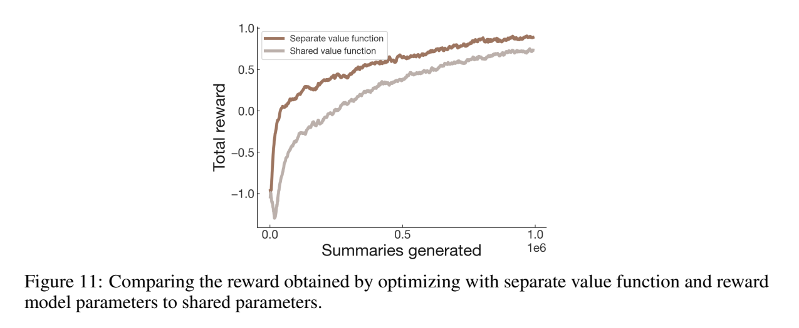

## 3. 主要实验结果

### 3.1 RLHF 明显优于监督学习

作者以“模型摘要相对于数据集人工摘要的偏好率”衡量质量。

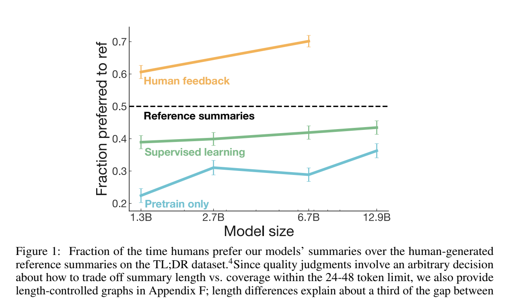

核心结果包括：

- **1.3B RLHF 模型**的摘要相对人工参考摘要获得 **61%** 的偏好率；
- 一个规模约大十倍的监督模型只有 **43%**；
- 1.3B 和 6.7B RLHF 模型都被标注员认为优于数据集中的人工参考摘要；
- 6.7B RLHF 模型优于 1.3B RLHF 模型，说明人类反馈训练同样受益于模型规模。

这说明在该任务中，**改进训练目标比单纯扩大监督模型更有效**。

### 3.2 提升主要来自信息覆盖度

标注员从整体质量、覆盖度、连贯性和准确性四个维度，以 7 分量表评价摘要。

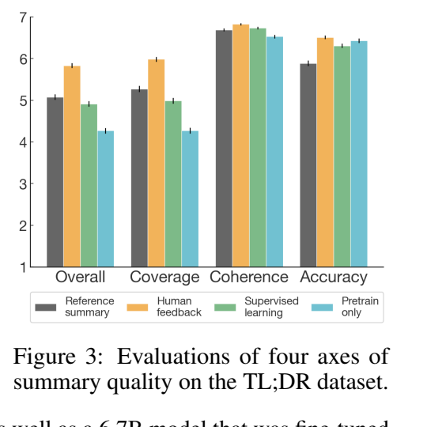

RLHF 模型在四个维度上都优于监督模型，提升最明显的是**覆盖度**。6.7B PPO 模型获得整体质量满分的比例为 **45%**，而：

- 6.7B 监督模型为 20%；
- 人工参考摘要为 23%。

附录给出了各类模型的完整比较：

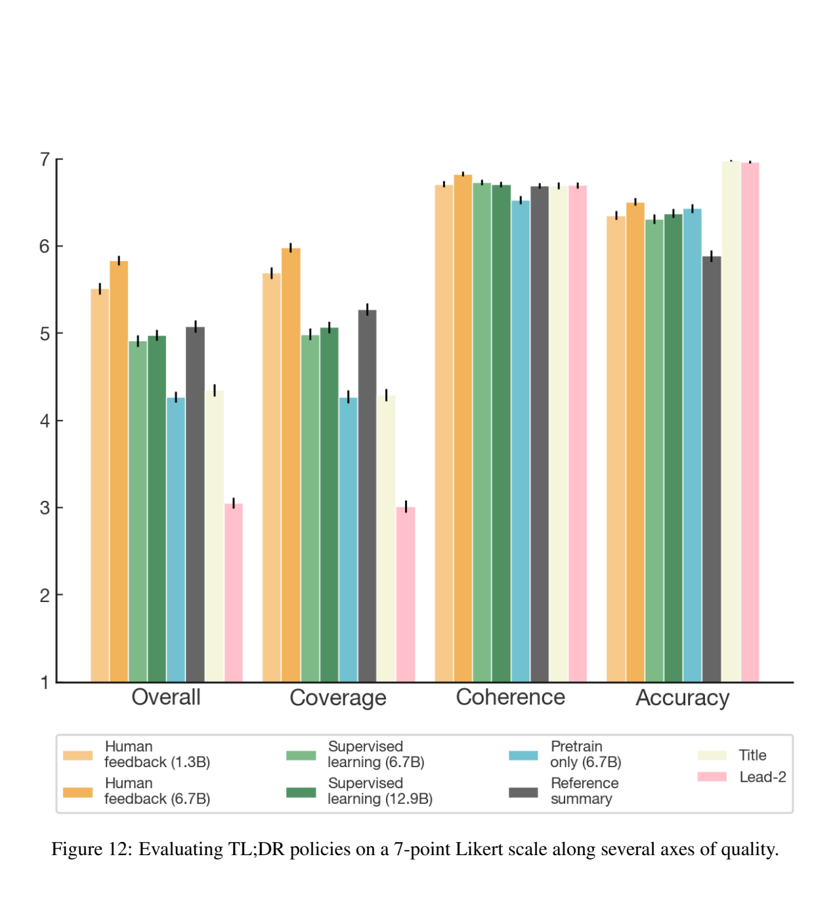

### 3.3 质量提升不只是因为摘要变长

RLHF 模型倾向于生成更长的摘要，而较长摘要通常能够覆盖更多信息。控制摘要长度后，RLHF 模型的优势有所缩小，但 6.7B 模型仍有约 **65%** 的摘要优于人工参考摘要。

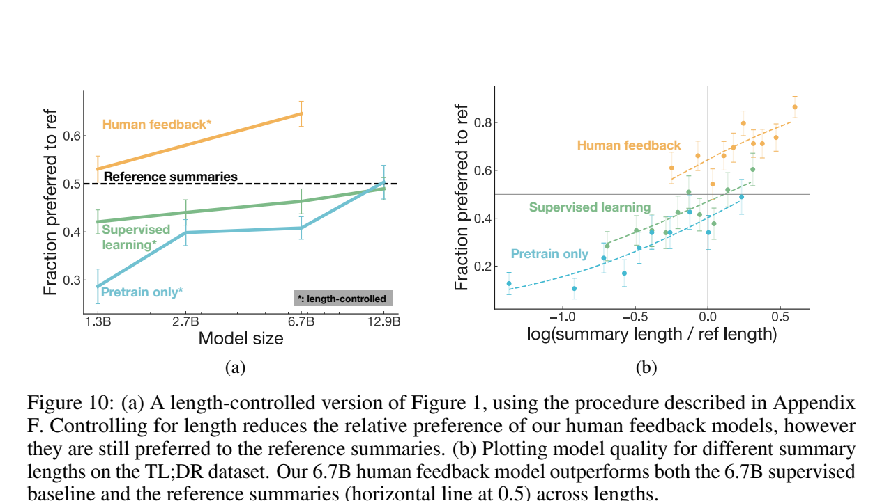

因此，摘要长度解释了部分提升，但不是全部原因。

### 3.4 能迁移到未训练过的新闻领域

模型只在 Reddit TL;DR 上训练，但作者直接将其用于 CNN/DailyMail 新闻摘要。

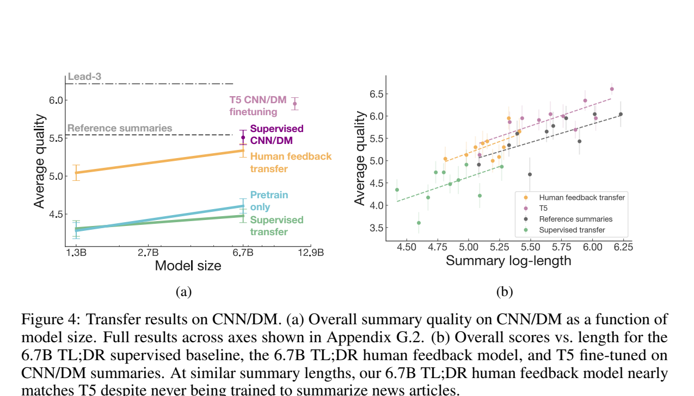

6.7B RLHF 模型：

- 明显优于在 TL;DR 上监督训练的模型；
- 接近专门在 CNN/DailyMail 上训练的模型；
- 生成的摘要明显更短。

这表明奖励模型学到了一部分跨领域的“摘要质量”概念，而不只是 Reddit 数据的表面特征。

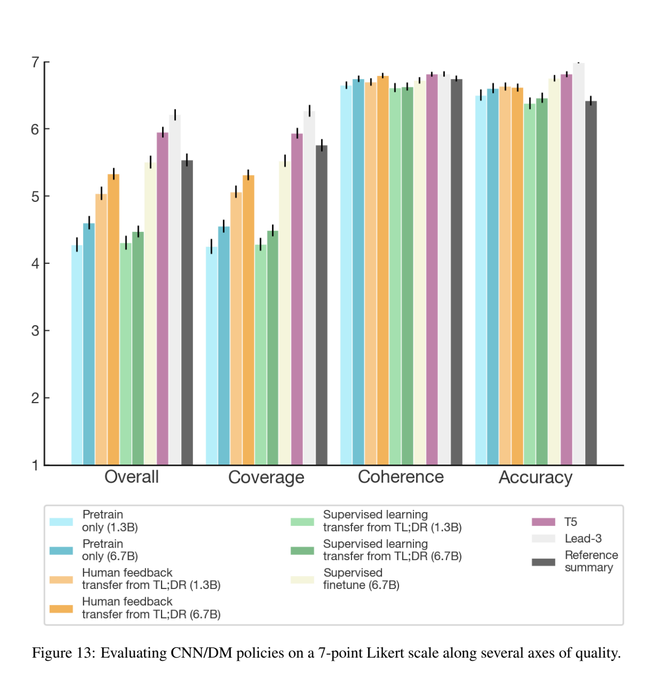

### 3.5 奖励模型随数据量和模型规模提升

作者训练了从 160M 到 13B 参数的奖励模型，并使用 8K–64K 条人类比较数据：

- 训练数据量翻倍，验证准确率平均提高约 **1.1 个百分点**；
- 模型规模翻倍，验证准确率平均提高约 **1.8 个百分点**。

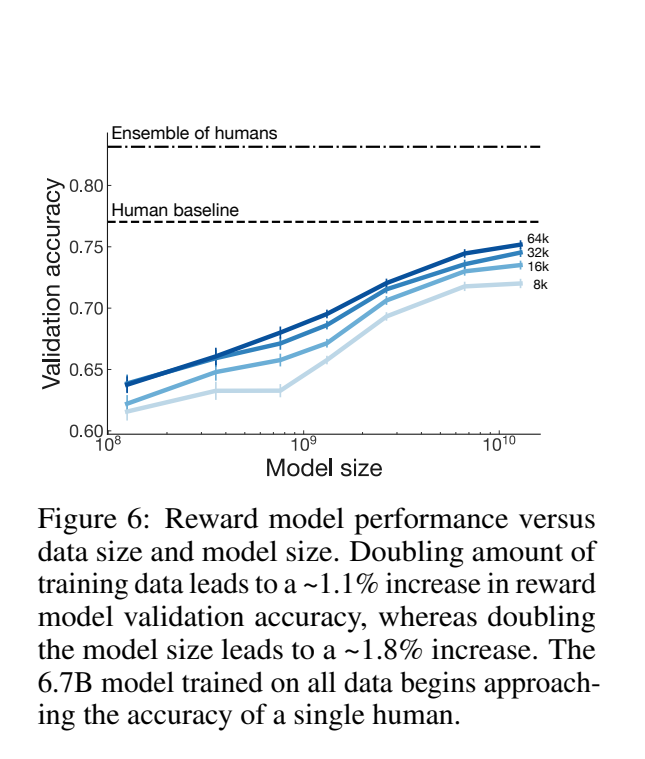

在未参与训练的 CNN/DailyMail 数据上：

- 1.3B 奖励模型与标注员偏好的一致率为 62.4%；
- 6.7B 奖励模型为 66.5%；
- 人类标注员之间的一致率为 66.9%。

6.7B 奖励模型已经接近单个人类标注员的预测水平。

### 3.6 奖励模型能识别细微语义变化

面对人工进行的小幅改进，6.7B 奖励模型有 **82.8%** 的概率选择修改后的摘要，人类评估者为 84.1%。当摘要中的人物角色被互换时，6.7B 奖励模型有 **97.2%** 的概率识别出原摘要更好。

不过，奖励模型对较长摘要存在偏好：当人工修改让摘要更短但质量更好时，6.7B 奖励模型只有 62.6% 的选择正确率，而人类为 76.4%。

## 4. 关键风险：奖励模型过度优化

论文最重要的发现之一，是奖励模型不能被无限优化。

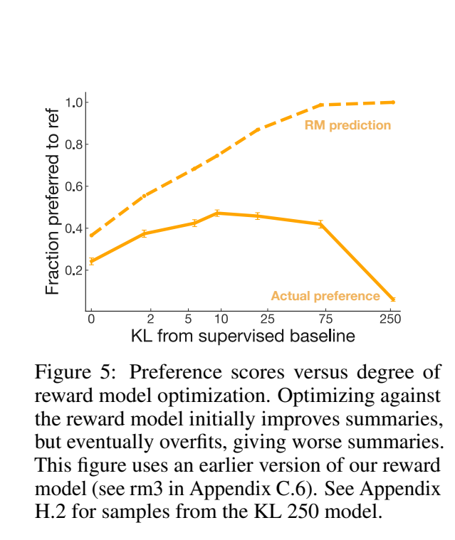

随着 PPO 优化强度增加：

1. 初期奖励分数与真实人类偏好同时上升；
2. 继续优化后，奖励模型预测仍在上升；
3. 真实人类偏好却开始下降；
4. 极端情况下，奖励模型分数与人类偏好变成负相关。

这正是后来常说的 **reward hacking、奖励模型过优化或 Goodhart 定律**：当代理指标成为强优化目标后，它就不再可靠地代表真实目标。KL 惩罚可以缓解这一问题，但不能彻底解决。

## 5. 与 ROUGE 等自动指标的比较

ROUGE 在监督模型样本之间预测人类偏好的准确率约为 57%，但在比较 RLHF 模型样本时下降到约 50%，接近随机。

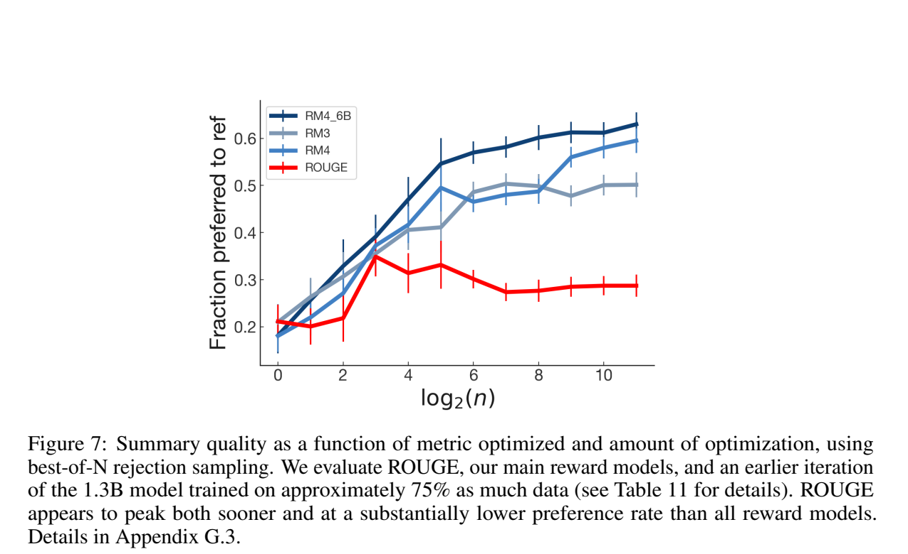

直接优化 ROUGE：

- 很快达到质量上限；
- 人类评价显著低于奖励模型优化；
- 继续提高 ROUGE 并不会持续提高真实摘要质量。

论文中的 ROUGE 分数也显示：人类更偏好的 RLHF 模型并不一定拥有更高 ROUGE。

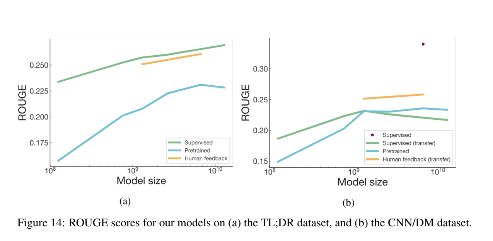

## 6. 其他工程发现

作者比较了温度采样和 nucleus sampling。对于最终人工评价，低温度、接近贪心的生成效果最好。

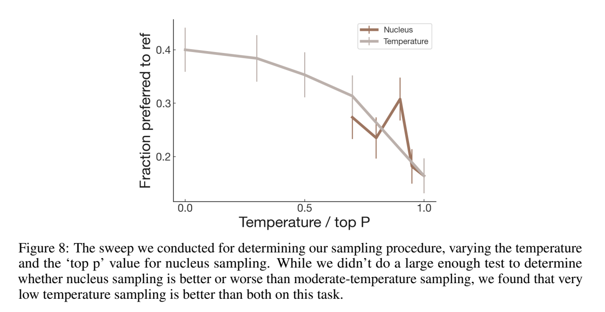

这一结果只针对论文中的短摘要任务，不一定能直接推广到开放式创作或多样性要求更高的任务。

## 7. 局限性

1. **成本很高**：6.7B 模型的 PPO 微调约需 320 GPU-days，人类数据收集耗费数千小时。
2. **缺少等成本 SFT 对照**：论文没有与同等成本、同等质量的大量人工示范进行完整比较，因此不能证明偏好学习在所有情况下都比高质量示范更高效。
3. **奖励模型存在系统偏差**：例如偏好更长的摘要，并可能对分布外输出给出错误高分。
4. **人类偏好不等于客观真理**：标注结果依赖研究人员制定的标准、标注员群体及其价值判断。
5. **任务范围有限**：主要实验是 24–48 token 的短摘要，不能直接代表长文本生成、对话或复杂推理任务。
6. **数据风险**：Reddit 原始帖子可能包含偏见、冒犯内容和有害信息，模型也可能继承这些问题。

## 8. 论文贡献与意义

这篇论文的重要性不仅在于提高摘要质量，更在于较早系统验证了后来广泛用于大语言模型对齐的流程：

```text
预训练模型
    ↓
监督微调 SFT
    ↓
收集人类偏好比较
    ↓
训练奖励模型 RM
    ↓
PPO + KL 惩罚优化策略
    ↓
重新收集数据并迭代
```

论文给出了两个影响深远的结论：

1. **训练目标是否贴近人类真实需求，可能比单纯增加模型参数更重要。**
2. **学习到的奖励只是人类偏好的近似；优化越强，越要警惕模型利用奖励漏洞。**

因此，这篇论文既是 RLHF 有效性的早期强证据，也很早就展示了 RLHF 最核心的风险。

## 9. 阅读时需要特别区分的几点

- 这篇论文**不是 PPO 原始论文**，而是将 PPO 用于语言模型人类反馈训练的重要应用论文。
- 论文证明的是“在人类标注标准下，RLHF 摘要更受偏好”，并不意味着模型获得了完全客观的摘要能力。
- 最值得关注的不是某个单独分数，而是“人类偏好目标优于 ROUGE”与“奖励模型会被过度优化”这两个同时成立的结论。
